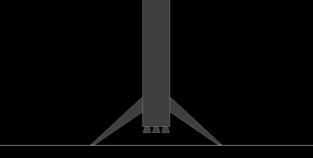

# BoosterLanding
# LandingBooster
# RocketLanding
# BoosterLander

tl;dr: Simulation framework for propulsive booster landing.

The booster's goal is to reach the landing pad at height $0$ at a velocity smaller or equal to $v_{\text{max}}$.

Boosters are equipped with neural networks for thrust control.

---
## TODOs
- Use trainer from src that uses project specific optimizer
- Use neural network for thruster control
- Update renderer to move point of view
- Add pause option to framework
- Create version of code that can be used for genetic optimization as well as for reinforcement learning.
    - Restrict deflection of engine to defined number of degrees.
        - Test engines
    - Move simulation / optimization loop to Optimizer class.
    - Equip booster with descent neural network (genetic: jax/numpy, reinforcement learning jax/pytorch).
- Reinforcement learning
    - Action space (do nothing, fire engine at discrete angles, )
    - Observation space (position x, position y, velocity x, velocity y, angle, angular velocity, boolean if leg is in contact with landing pad)
- Genetic optimization
    - Use award function that consist of $T$ terms standing for $T$ times a score based on certain criteria has been computed. Use a weighted sum to compute final score. $S = \gamma_0s_0 + \gamma_1s_1 + ... + \gamma_Ts_T$ where $\gamma$ weights earlier awards less. Award $s$ can be sum of distance to center of landing pad and horizontal / vertical velocity.
---

## Introduction



Inspired by SpaceX's incredible progress, I set up a simple environment in PyBox2D
that allows to use different methods to land a booster in a physical simulation.

The booster's physics is modeled using PyBox2D, a 2D physics library for simple simulations. The booster consists of three sections. A long and low density section (the booster's hull containing mostly empty fuel tanks) connected to a short high density section (the booster's engines). On top of that there are the landing legs which are modeled as medium density sticks attached to the lower part of the rocket in a 45 degree angle.

The landing of the booster is learned using a genetic algorithm to optimize a small neural network, the booster's brain. The network's input are the booster's current height (x, y), speed (vx, vy), acceleration (ax, ay) and remaining fuel (maybe in a later stage).

This project can also be tackled with deep reinforcement learning (e.g. deep Q-learning).

## Prepare environment for reinforcement learining

Activate environment to install *pybox2d* and *pygame*.

```console
conda activate env
```

### Install pybox2d

```console
conda install -c conda-forge pybox2d
```

### Install Pygame

```console
python3 -m pip install -U pygame --user
```

## Implementation

GeneticBooster uses pybox2d to simulate the pysics and pygame for visualization. To speed up learning, $N$ booster are simulated in parallel.

## Help 

Minimal examples: https://github.com/pybox2d/pybox2d/tree/master/library/Box2D/examples

Docs: https://github.com/pybox2d/cython-box2d/blob/master/docs/source/getting_started.md

Box2D Reference: https://box2d.org/documentation

b2Body Class Reference: https://box2d.org/documentation/classb2_body.html

